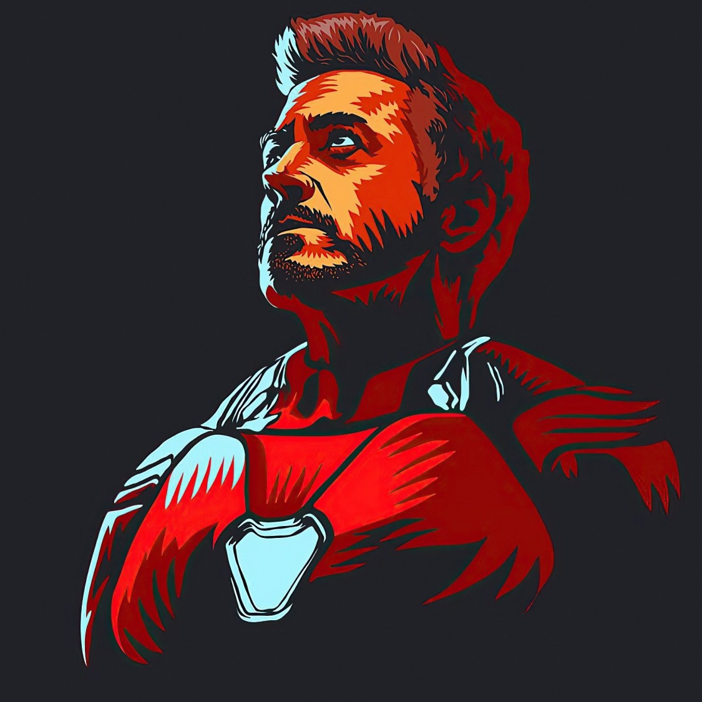

<link rel="stylesheet" href="https://cdnjs.cloudflare.com/ajax/libs/font-awesome/6.0.0/css/all.min.css" integrity="sha512-9usAa10IRO0HhonpyAIVpjrylPvoDwiPUiKdWk5t3PyolY1cOd4DSE0Ga+ri4AuTroPR5aQvXU9xC6qOPnzFeg==" crossorigin="anonymous" referrerpolicy="no-referrer" />

    

      
    

    

        
1000 Stars for Full Source Code ⭐

        
Unlock the Power of Jarvis-4.0

    

    

<h1 align="center">Jarvis-4.0</h1>

  <b>The Most Advanced Jarvis on YouTube, Coming Soon!</b> 🚀

    

        <a href="https://www.youtube.com/@Sreejan" class="social-button youtube" target="_blank" style="padding: 8px 15px;">
            <i class="social-icon fab fa-youtube"></i>
        </a>
        <a href="https://twitter.com/Sreejan" class="social-button twitter" target="_blank" style="padding: 8px 15px;">
            <i class="social-icon fab fa-twitter"></i>
        </a>
        <a href="https://linkedin.com/in/sreejan" class="social-button linkedin" target="_blank" style="padding: 8px 15px;">
            <i class="social-icon fab fa-linkedin"></i>
        </a>
        <a href="https://discord.gg/Sreejan" class="social-button discord" target="_blank" style="padding: 8px 15px;">
            <i class="social-icon fab fa-discord"></i>
        </a>
        <a href="https://t.me/Sreejan" class="social-button telegram" target="_blank" style="padding: 8px 15px;">
            <i class="social-icon fab fa-telegram"></i>
        </a>
    

   
    

 

  **Welcome, Visionaries!** 👋 Get ready to witness the evolution of personal assistants! This repository is the official home of **Jarvis-4.0**, the most sophisticated and feature-rich Jarvis iteration ever showcased on YouTube! :youtube:

  We're building something extraordinary here, and you're invited to be a part of it. This repository currently contains the foundational boilerplate. But here's the exciting part: **The complete, fully functional, and mind-blowing source code of Jarvis-4.0 will be made available to the public once this repository reaches the milestone of 1000 stars!** ⭐

  Your star isn't just a symbol of appreciation; it's a powerful vote of confidence. It's a direct contribution to unlocking the full potential of Jarvis-4.0 and making this advanced technology accessible to everyone. Join us on this journey, let's reach 1000 stars together, and revolutionize the world of personal assistants!

 

 

<h2>
  🔗 <b>Roadmap & More Details</b>
</h2>

  Curious to learn more about the future of Jarvis-4.0? Explore the detailed development roadmap and in-depth feature descriptions at the following links:

  *   **Roadmap Series:** [https://roadmap.jarvis.sree.shop](https://roadmap.jarvis.sree.shop)
  *   **Feature List & Details:** [https://jarvis.sree.shop](https://jarvis.sree.shop)

 

 

 

<h2>
  👀 <b>Jarvis-4.0: A Glimpse into the Future</b>
</h2>

  Jarvis-4.0 is not just another personal assistant; it's a meticulously engineered, cutting-edge AI companion designed to seamlessly integrate into your digital life. It boasts a vast array of functionalities, all working in harmony to provide an unparalleled user experience. Here's a preview of the groundbreaking features that await you:

 

<table>
  <tr>
    <td>
      <h3>🧠 AI-Powered Intelligence</h3>
      <ul>
        <li>Intelligent Agents: Autonomous agents for coding, search, and specialized tasks.</li>
        <li>Advanced Context Management: Natural and effective interactions in conversations and tasks.</li>
        <li>Content Generation & Verification: AI-powered content creation with accuracy checks.</li>
      </ul>
    </td>
    <td>
      <h3>💬 Comprehensive Communication Suite</h3>
      <ul>
        <li>Contact & Communication Management: Unified interface for managing contacts and channels.</li>
        <li>Integrated Communication Tools: Email, messaging, and meeting tools in one place.</li>
        <li>Smart Notification System: Prioritized information and customizable alerts.</li>
      </ul>
    </td>
    <td>
      <h3>⚙️ Robust Core System</h3>
      <ul>
        <li>Highly Flexible Configuration: Tailor Jarvis-4.0 to your needs.</li>
        <li>Efficient State Management: Ensures reliability and performance.</li>
        <li>Detailed Logging & Monitoring: Insights into system behavior.</li>
      </ul>
    </td>
  </tr>
  <tr>
    <td>
      <h3>📱 Seamless Device Integration</h3>
      <ul>
        <li>Unified Device Management: Centralized control over connected devices.</li>
        <li>Smart Home Automation: Control lighting, temperature, and security.</li>
        <li>Effortless Sync Management: Consistent user experience across devices.</li>
      </ul>
    </td>
    <td>
      <h3>📁 Powerful File Handling</h3>
      <ul>
        <li>Advanced Data Extraction & Parsing: Extract data from various file types.</li>
        <li>Intelligent File Finder & Organizer: Locate and organize files efficiently.</li>
        <li>Integrated OCR Capabilities: Extract text from images and scanned documents.</li>
      </ul>
    </td>
    <td>
      <h3>📡 Advanced Input Processing</h3>
      <ul>
        <li>Multi-Modal Interaction: Voice, facial recognition, or gesture control.</li>
        <li>Intelligent Interrupt Handling: Smooth workflow during multitasking.</li>
      </ul>
    </td>
  </tr>
  <tr>
    <td>
      <h3>💻 System & Task Management</h3>
      <ul>
        <li>System Automation Tools: Automate repetitive tasks.</li>
        <li>Integrated Media & Power Control: Manage media and power settings.</li>
        <li>Real-time Resource Monitoring: Track system resource usage.</li>
        <li>Quick Screenshot Capture: Instant screenshot capture.</li>
        <li>Comprehensive Task Scheduling & Reminders: Stay organized.</li>
      </ul>
    </td>
    <td>
      <h3>🎨 Intuitive User Interface</h3>
      <ul>
        <li>User-Friendly Chat Interface: Natural and intuitive chat.</li>
        <li>Versatile Application Access: Access from the main window or system tray.</li>
        <li>Personalizable Theme Management: Customize the look and feel.</li>
      </ul>
    </td>
    <td>
      <h3>🌐 Web & Voice Integration</h3>
      <ul>
        <li>Seamless API & Browser Management: Interact with APIs and control your browser.</li>
        <li>Efficient Web Scraping: Extract data from the web.</li>
        <li>Secure Voice Authentication & Engine: Secure voice control.</li>
        <li>Advanced Voice Recognition & Wake Word Detection: Hands-free control.</li>
      </ul>
    </td>
  </tr>
</table>

 

 

  **📂 Explore the Depths!**

  Venture into the subdirectories of this repository! Each one houses its own `README.md` file, offering specific insights and detailed context for every module within Jarvis-4.0. By exploring these files, you'll gain a comprehensive understanding of the project's intricate architecture and the inner workings of each component.

